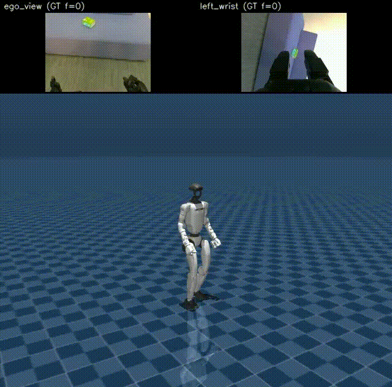

# Φ-0

单目 egocentric 视频 + 语言 → **未来 action chunk**。视觉-语言侧 **Qwen3-VL-2B**（Psi0 checkpoint，默认冻结）提取 multimodal context；动作侧 Action DiT（**ACT** 直接回归或 **FM** flow matching）。支持 **256-d** keypoints（legacy）与 **512-d unified**（Xperience / pick-tissue / SONIC）。

> 架构已从 Cosmos Video2World hook 迁移至 Qwen3-VL encoder；不再依赖 Cosmos 权重或视频生成路径。

---

## 模型架构

<p align="center">
  
</p>

**双塔 / 三塔结构**：Qwen3-VL 提供视觉-语言 hidden states（2048-d）供 Action DiT cross-attention；可选 VGGT-Omega 塔提供 3D scene registers；Action DiT 预测未来 action chunk（horizon 由配置决定，如 29 步 @ 20 Hz 或 pick-tissue @ 50 Hz）。

| 模块 | 默认 | 说明 |
|------|------|------|
| Qwen3-VL-2B | 冻结 | Psi0 checkpoint，`vlm.model_path`；`extract_action_context()` → 最后一层 hidden |
| Processor | — | `qwen_vl_utils` + chat template；图像 180×320（H×W，Psi0 对齐） |
| VGGT（可选） | `phi0_dual_vggt` | `vggt_omega_1b_512.pt`，aggregator 冻结 |
| Action 头 | `act` | Action DiT；`past_action_window_size` 依任务（legacy 4 / pick-tissue 1） |

Cross-attn 模式（`action_cross_attn_mode`）：

| 模式 | 偶数层 | 奇数层 | 配置 |
|------|--------|--------|------|
| `interleave_vlm`（双塔基线） | cross → Qwen3-VL hidden | 仅 self+FFN | `phi0_full` |
| `dual_vlm_vggt`（三塔） | cross → Qwen3-VL | cross → VGGT registers | `phi0_dual_vggt` |

旧名 `interleave_cosmos` / `dual_cosmos_vggt` 在代码中仍作别名，均映射到上述 VLM 路径。

---

## Eval 效果（legacy 256-d）

历史 baseline `phi0_act_proprio_800step` 在 Xperience demo 上的 skeleton 预测可视化（绿=GT，蓝=Pred）：

<p align="center">
  
</p>

---

## Eval 效果（pick-tissue SONIC）

`pick_tissue_xperience_unified_3k_ddp4_fast` 在默认 eval clip **ep447** 上的开环 SONIC deploy（上：ego + 左腕 GT 视频；下：MuJoCo sim + TensorRT deploy + Dex3 三指夹爪）：

<p align="center">
  
</p>

生成命令见下文 [Pick-tissue 工作流 §3](#3-sonic-开环-eval--录-mp4推荐含三指夹爪)；录屏来源：`logs/pick_tissue_finetune/sonic_latent_model_<ts>/pick_tissue_ep447_sonic_latent_model.mp4`。

---

## Eval 效果（LangChain Agent → Phi0 → SONIC sim）

用户说：**「你可以把沙发上的纸巾拿起来么？」**；官方 **Qwen3-VL-2B-Instruct**（LangChain + tool calling）结合 ep447 **ego + 左腕**画面理解意图并中文回复；选中 `pick_tissues` 后走与 §3 **相同的 SONIC latent 开环管线**（publisher **在线加载 VLM+Phi0 推理** dataset clip → ZMQ v4 → TensorRT deploy + Dex3 + MuJoCo 录屏）。

<p align="center">
  
</p>

```
用户指令 + ego/左腕图
    → LangChain Agent（官方 Qwen3-VL，与 Psi0 VLM 分离）
    → tool: pick_tissues | throw_rubbish | stay
    → Phi0SkillRouter（按 skill 懒加载 checkpoint）
    → run_pick_tissue_sonic_latent_eval.sh（仅 action skill）
    → agent_*_sonic_latent_model.mp4
```

| 环节 | 组件 | 说明 |
|------|------|------|
| 语言 | `Qwen/Qwen3-VL-2B-Instruct` | Psi0 内嵌 VLM **无语言能力**，Agent 必须用官方权重 |
| 技能 | `pick_tissues` / `throw_rubbish` / `stay` | 映射 Phi0 prompt：`pick tissue` / `throw rubbish`；`stay` 不调 Phi0 |
| 权重路由 | `src/phi0/agent/checkpoints.py` | 每 skill 独立 ckpt；`throw_rubbish` 占位路径，训好只改路径 |
| 执行 | `run_pick_tissue_sonic_latent_eval.sh` | 与 §3 相同；**不是** HGPT tracker 线 |

**已测产物**（ep447，`MOTION_SECONDS=8`）：

| 文件 | 说明 |
|------|------|
| `Phi_0/logs/agent_sonic_sim_demo/agent_result.json` | Agent 回复、`tool_steps`、`selected_skill`、`model_raw` |
| `Phi_0/logs/agent_sonic_sim_demo/agent_pick_tissues_ep447_sonic_latent_model.mp4` | SONIC sim 录屏（~12s H.264） |

成功标志：`agent_result.json` 里 `tool_steps` 非空且含 `pick_tissues`；mp4 在 `Phi_0/logs/...`（`out-dir` 会 resolve 为绝对路径，与 sim 读写的 flag 一致）。

一键复现（**由 Agent 自行选技能并驱动 Phi0**，不要加 `--force-skill`）：

```bash
pip install -e ".[agent]" -i https://pypi.tuna.tsinghua.edu.cn/simple   # langchain + langchain-core

CUDA_VISIBLE_DEVICES=4 \
GT_PANEL_LAYOUT=top ENABLE_G1_DEBUG_OVERLAY=0 \
bash scripts/run_phi0_agent_zmq_sim_demo.sh \
  --user-instruction '你可以把沙发上的纸巾拿起来么？' \
  --episode-idx 447 \
  --motion-seconds 8 \
  --out-dir logs/agent_sonic_sim_demo
```

首轮约 3min（Agent Qwen3-VL + SONIC publisher 各加载一次 VLM）。`tool_steps` 为空说明模型未输出 `<tool_call>`——见 `src/phi0/agent/prompts.py` 与自动重试逻辑。

仅测 Agent（不启 SONIC sim / deploy）：

```bash
PYTHONPATH=src python scripts/phi0_langchain_agent_demo.py --dry-run
```

跳过 Agent、直接测 SONIC 执行：`bash scripts/run_phi0_agent_zmq_sim_demo.sh --force-skill pick_tissues`。

**复用 npz（可选，加速重复录屏）**：默认 publisher **inline 推理**（无离线 precompute）。仅反复录同一轨迹时可：

```bash
# 生成缓存（可选）
FORCE_PRECOMPUTE=1 CHECKPOINT=... bash scripts/run_pick_tissue_sonic_latent_eval.sh ...

# Agent demo 指定已有 npz
PRECOMPUTE_IN=logs/.../sonic_latent_precompute.npz bash scripts/run_phi0_agent_zmq_sim_demo.sh ...
```

**SONIC eval 同步说明**：`run_pick_tissue_sonic_latent_eval.sh` 将 `WORK_DIR` 转为绝对路径（sim 在 `GR00T-WholeBodyControl/` 下跑，相对路径会导致 `.record_start` / `.replay_go` 错位、录屏失败）。Publisher 在 deploy 站稳且 `sim_record` 启动后才收到 `.replay_go`；默认 `--ready-timeout-s 900`（正常 ~30–60s，慢环境留余量）。可覆盖：`REPLAY_READY_TIMEOUT_S=300`。

细节见 [Pick-tissue 工作流 §7](#7-langchain-agent-全链路推荐语言--sonic-执行)。

---

## 设计优势

### 性能

- **低显存**：VLM 冻结 + 仅训 action_expert 时，pick-tissue 单卡可训可推。
- **推理**：VLM 单次 forward 抽 context，无 Cosmos 17 帧 latent 管线开销。
- **短期记忆**：proprio 前缀 + 当前帧（及可选 VGGT register）作为 action 条件。

### 训练与算法

- **统一表示**：State-Action 同构；512-d unified 一条 token 编码人体 + 机器人 + SONIC latent。
- **Mask Training**：`action_dim_is_pad` 按数据集语义屏蔽未监督维（如 `g1_sonic` 不监督 root delta）。
- **缺失数据训练**：局部 loss 支持不完整 Mocap、无触觉等。

### 扩展能力

- **模块化**：VLM / VGGT / Action Head 可独立冻结或替换。
- **可扩展输出**：256-d 仅监督 keypoints；512-d 按 schema 分段监督。
- **可插拔 Action Head**：ACT / FM；checkpoint 可只存 action_expert。

### 工程与商业化

- **控制器兼容**：SONIC deploy（ZMQ v4 latent，**推荐**）、Humanoid-GPT tracker（备选）、GMT 等。
- **语言 Agent 外挂**：Phi0 VLM 仅 encoder；对话与 tool 调度由 `src/phi0/agent/`（官方 Qwen3-VL + LangChain）承担，再路由到 Phi0 action head。
- **快速场景迁移**：Action Head 权重独立 fine-tune（如 pick-tissue 3k/8k/23k）。

---

## 源码与权重获取

**集群内一键复制（推荐）**：

```text
cluster_0:/mnt/data2/wpy/workspace
```

```bash
rsync -av --progress cluster_0:/mnt/data2/wpy/workspace/ /your/local/workspace/
```

| 路径 | 内容 |
|------|------|
| `Phi_0/` | 本仓库源码 |
| `Phi_0/checkpoints/psi0/` | **Qwen3-VL**（Psi0 pretrain，含在 checkpoint 目录内） |
| `Phi_0/experiments/` | 实验 checkpoint（gitignore，本地/rsync 获取） |
| `vggt-omega/checkpoints/` | VGGT-Omega（三塔可选） |
| `Isaac-GR00T/data/` | pick-tissue 等 LeRobot 数据集 |

GitHub 仓库仅含**源码**；权重与实验输出不入库。

---

## 快速开始

### 环境

```bash
conda create -n Phi-0-wpy python=3.10 -y && conda activate Phi-0-wpy
pip install -e /path/to/FastWAM
pip install -e /path/to/Phi_0[train,viz]
pip install -e /path/to/Phi_0[agent]   # LangChain Agent demo（langchain + langchain-core）
pip install qwen-vl-utils   # Qwen3-VL 预处理
pip install -e /path/to/vggt-omega   # 三塔 dual 模式（可选）
```

Smoke：

```bash
PYTHONPATH=src:/path/to/FastWAM/src python scripts/smoke_test.py
```

### VLM 权重

Qwen3-VL 路径在 `configs/model/phi0_full.yaml` → `vlm.model_path`（默认 Psi0 bundle）：

```yaml
vlm:
  model_path: ./checkpoints/psi0/pre.fast.1by1.2601091803.ckpt.ego200k.he30k/...
  freeze: true
```

从集群拷贝 `checkpoints/psi0/` 即可；**无需** Cosmos-Predict2.5 权重。  
`scripts/download_cosmos_weights.sh` 为历史遗留，当前主路径不再使用。

### 训练

```bash
# Legacy 256-d ACT + proprio
PYTHONPATH=src python scripts/train.py --config-name train_act_proprio_800 device=cuda mixed_precision=bf16

# Pick-tissue 512-d unified（推荐 wrapper）
bash scripts/run_train_pick_tissue_xperience_unified_ddp4_3k.sh

# Xperience 512-d unified
bash scripts/run_train_xperience_unified_ddp4.sh
```

Checkpoint：`experiments/<name>/<name>_latest.pt`（可 `save_action_expert_only`）。

### Eval / 可视化

```bash
python scripts/eval_action.py --checkpoint ... --config-name train_xperience_unified
bash scripts/run_eval_visualize_xperience_unified.sh
bash scripts/run_pick_tissue_sonic_latent_eval.sh   # SONIC deploy + mp4
bash scripts/run_phi0_agent_zmq_sim_demo.sh         # LangChain Agent + SONIC（见 §7）
```

### Deploy

Legacy 256-d JSONL deploy 仍可用；pick-tissue **推荐 SONIC**（§3 / §7）；HGPT tracker 见 §4。

---

## 技术细节

### 数据流（VLM → Action）

```
RGB frame(s) + task instruction
  → Qwen3-VL processor (chat template, add_generation_prompt)
  → VLM forward (frozen, output_hidden_states=True)
  → hidden_states[-1]  [B, S, 2048]  → Action DiT cross-attn context

[可选] RGB clip ──► VGGT-Omega aggregator (frozen) ──► scene registers
                      └── 奇数层 cross-attn (dual_vlm_vggt)

Proprio 前缀 + future horizon ──► ActionACTDiT / ActionFMDiT ──► action chunk
```

VLM 默认仅 **encoder forward** → Action DiT；**训练与常规 action 推理不会**调用 `generate`。

**Eval 可选 Agent 说话**（显式 `--enable-agent-speech` / `enable_agent_speech_for_eval(True)`，整段 eval **只做一次** AR，首帧输入快照；`refresh_*` 与多 chunk `predict` 不重复生成）：

```python
session.enable_agent_speech_for_eval(True)  # 首次 prefill 之前
session.prefill_from_video_clip(video, instruction)
agent_text = session.run_agent_speech_once()
action = session.predict(num_frames)
```

Demo（默认 ep447，`--skip-action` 仅测 VLM 说话）：

```bash
CUDA_VISIBLE_DEVICES=4 python scripts/vlm_agent_speech_demo.py \
  --enable-agent-speech --episode-idx 447 --skip-action
```

### 损失

```text
loss = λ_a · MSE_action (+ bone / hand 辅助项，legacy 256-d)
```

- Unified / pick-tissue：`lambda_video = 0`，无视频生成 loss。
- MSE 受 `action_is_pad`、`action_dim_is_pad` 掩码。

### Clip 时间轴（legacy 20 Hz 示例）

| 参数 | 值 | 含义 |
|------|-----|------|
| `control_fps` | 20 Hz | 统一 action 时间轴 |
| `seq_len` | 33 | control 窗口 |
| `past_action_window_size` | 4（legacy） / 1（pick-tissue） | proprio 前缀 |

Pick-tissue 使用 **50 Hz**，见 unified 文档。

### D_raw（256 维）

| 切片 | 索引 | 维数 | 训练 loss | 说明 |
|------|------|------|-----------|------|
| `keypoints_52` | 0:156 | 156 | ✅ | 52 关节 × (x,y,z) |
| `legacy_buffer_gap` | 156:211 | 55 | ❌ | 保留对齐 legacy buffer |
| `betas_storage` | 211:227 | 16 | ❌ | 元数据存储槽 |
| `tactile_storage` | 227:237 | 10 | ❌ | 触觉预留 |
| `reserved` | 237:256 | 19 | ❌ | padding |

### Pick-tissue unified（512 维，50 Hz）

完整 action 布局、dim mask、deploy 路径见 **[`docs/unified_action_design.md`](docs/unified_action_design.md)**。

概要：一条 `unified_action[512]` 同时编码 SMPL 人体、Dex3 夹爪、G1 body qpos、SONIC motion_token。

| 切片 | 内容 | pick-tissue loss（`g1_sonic`） |
|------|------|-------------------------------|
| `0:3` | root trans delta | ❌ |
| `3:346` | SMPL-H body | ✅ |
| `346:360` | Dex3 14 维（WBC 顺序） | ✅ |
| `360:396` | G1 qpos 36 维（采集 WBC，非 GMR） | ✅ |
| `396:460` | SONIC motion_token 64 维 | ✅ |
| `460:512` | reserved | ❌ |

数据目录：`Isaac-GR00T/data/pick_tissue_xperience_unified`（由 `pick_tissue_valid` 转换，`CODE_VERSION=v2.8`）。

---

## Pick-tissue 工作流

### 1. 建数据

Manifest：`Isaac-GR00T/data/pick_tissues.json`（pick tissue）、`throw_rubbish.json`（throw rubbish）。一键重建 GR00T valid + Phi0 unified + sonic unified：

```bash
bash /mnt/data2/wpy/workspace/Isaac-GR00T/scripts/rebuild_g1_manip_training_data.sh
```

输出：

| 路径 | 用途 |
|------|------|
| `pick_tissue_valid` | 仅 pick tissue（eval ep447 等沿用） |
| `g1_manip_valid` | pick tissue + throw rubbish 多任务 GR00T |
| `pick_tissue_xperience_unified` | Phi0 512-d（pick only） |
| `g1_manip_xperience_unified` | Phi0 512-d 多任务训练 |
| `pick_tissue_sonic_unified` / `g1_manip_sonic_unified` | pi0.5 sonic 格式 |

各数据集 `meta/tasks.jsonl` 写入对应 prompt（`pick tissue` / `throw rubbish`），parquet `task_index` 与之一致。

```bash
# 仅 pick-tissue valid 合并（旧路径，单任务）
/mnt/data/miniconda3/envs/Phi-0-wpy/bin/python scripts/data/isaac_groot_to_xperience_unified_lerobot.py \
  --data-root /mnt/data2/wpy/workspace/Isaac-GR00T/data/pick_tissue_valid \
  --out-dir /mnt/data2/wpy/workspace/Isaac-GR00T/data/pick_tissue_xperience_unified \
  --num-workers 8

# 从 raw session 一键 rebuild
bash scripts/run_pick_tissue_from_raw_rebuild_eval.sh

# 训练前 predecode 视频（4 路并行，cv2 backend）
bash scripts/data/run_predecode_pick_tissue_4gpu.sh
```

### 2. 训练（4×GPU DDP，action_expert only）

```bash
bash scripts/run_train_pick_tissue_xperience_unified_ddp4_8k.sh   # 8k steps
bash scripts/run_train_pick_tissue_xperience_unified_ddp4_3k.sh   # 3k 快速实验
bash scripts/run_train_pick_tissue_xperience_unified_ddp4_23k.sh  # 续训 23k
```

Checkpoint 示例：`experiments/pick_tissue_xperience_unified_3k_ddp4_fast/pick_tissue_xperience_unified_act_latest.pt`

### 3. SONIC 开环 eval + 录 mp4（**推荐**，含三指夹爪）

**默认 eval clip**：unified `episode_index=447`（manifest ep2，~831 帧 @50 Hz，task=`pick tissue`）。SONIC / HGPT / Agent demo 均以此为准，便于横向对比。

两阶段：离线 precompute（VLM 推理 → npz）→ sim + TensorRT deploy + ZMQ v4 流式回放。

```bash
# 模型 eval，ep447，top panel 无 marker，全 episode
CHECKPOINT=/mnt/data2/wpy/workspace/Phi_0/experiments/pick_tissue_xperience_unified_3k_ddp4_fast/pick_tissue_xperience_unified_act_latest.pt \
CONFIG_NAME=train_pick_tissue_xperience_unified_ddp4_3k \
UNIFIED_EP=447 \
GT_PANEL_LAYOUT=top \
ENABLE_G1_DEBUG_OVERLAY=0 \
MOTION_SECONDS=20 \
CUDA_VISIBLE_DEVICES=4 \
bash scripts/run_pick_tissue_sonic_latent_eval.sh

# GT 对照（不设 CHECKPOINT）
GT_PANEL_LAYOUT=top ENABLE_G1_DEBUG_OVERLAY=0 UNIFIED_EP=447 MOTION_SECONDS=20 \
bash scripts/run_pick_tissue_sonic_latent_eval.sh
```

**仅离线 precompute（不启 sim/deploy）：**

```bash
python scripts/phi0_sonic_latent_zmq_publisher.py \
  --checkpoint /path/to.ckpt \
  --config-name train_pick_tissue_xperience_unified_ddp4_3k \
  --episode-idx 447 \
  --motion-seconds 20 \
  --precompute-out logs/ep447_precompute.npz \
  --device cuda
```

输出默认：`logs/pick_tissue_finetune/sonic_latent_model_<ts>/pick_tissue_ep447_sonic_latent_model.mp4`

| 可视化 | 环境变量 |
|--------|----------|
| top panel + 无 marker（推荐） | `GT_PANEL_LAYOUT=top ENABLE_G1_DEBUG_OVERLAY=0` |
| inset + debug marker | 脚本默认 |
| 默认推理 | publisher 启动时 inline 加载 VLM+Phi0 |
| 复用 npz | `FORCE_PRECOMPUTE=1` 或 `--precompute-in` / `PRECOMPUTE_IN=...` |
| 录屏 flag | `WORK_DIR` 自动 `cd` 为绝对路径（勿用手写相对路径跨 `Phi_0` / `GR00T`） |

**从 npz 重放 ZMQ（不加载 VLM，调试用）：**

```bash
python scripts/phi0_sonic_latent_zmq_publisher.py \
  --precompute-in logs/pick_tissue_finetune/sonic_latent_model_<ts>/sonic_latent_precompute.npz \
  --config-name train_pick_tissue_xperience_unified_ddp4_3k \
  --episode-idx 447 \
  --zmq-port 5556 \
  --control-fps 50
```

### 4. Humanoid-GPT ZMQ eval（tracker sim，**无** Dex3 手模）

见 [`experiments/phi0_hgpt_zmq/README.md`](experiments/phi0_hgpt_zmq/README.md)。

```bash
CHECKPOINT=/path/to.ckpt EPISODE_IDX=447 USE_GT=0 DEPLOY_MODE=smpl \
CUDA_VISIBLE_DEVICES=4 bash scripts/run_pick_tissue_hgpt_zmq_eval.sh
```

### 5. 真机 SONIC 开环 deploy（ZMQ v4）

与 §3 相同数据路径（`phi0_sonic_latent_zmq_publisher.py` → ZMQ **5556** → `g1_deploy_onnx_ref --input-type zmq_manager`），**去掉 MuJoCo sim 与 mp4 录屏**，在 G1 真机上执行 precompute 轨迹。

> **开环**：precompute 使用数据集 ep447 的 ego/wrist 视频 + GT proprio LUT，**非**机载相机闭环。真机闭环需另接 camera server（5555）与在线推理，见 `GR00T-WholeBodyControl/G1_VISION_TO_GR00T.md`。

**前提**：`gear_sonic_deploy` 已编译；控制机与 G1 同网（`192.168.123.x`）；真机 deploy **不要**加 `--disable-crc-check`。

**Step 0 — 离线 precompute（可与 sim eval 复用同一 npz）：**

```bash
python scripts/phi0_sonic_latent_zmq_publisher.py \
  --checkpoint experiments/pick_tissue_xperience_unified_3k_ddp4_fast/pick_tissue_xperience_unified_act_latest.pt \
  --config-name train_pick_tissue_xperience_unified_ddp4_3k \
  --episode-idx 447 \
  --control-fps 50 \
  --motion-seconds 16.62 \
  --precompute-out /tmp/ep447_precompute.npz \
  --device cuda
```

**Step 1 — Terminal A：真机 C++ deploy**（`GR00T-WholeBodyControl/gear_sonic_deploy`）：

```bash
source scripts/setup_env.sh
./deploy.sh --input-type zmq_manager real --zmq-host 127.0.0.1 --zmq-port 5556
# Init Done 后：] 启动控制 → ENTER（ZMQ STREAMING MODE: ENABLED）→ I 站稳；O 急停
```

publisher 在另一台机器时，将 `--zmq-host` 改为 publisher 所在 IP。

**Step 2 — Terminal B：ZMQ 推流**（deploy 已进入 streaming 且站稳后）：

```bash
cd Phi_0
python scripts/phi0_sonic_latent_zmq_publisher.py \
  --precompute-in /tmp/ep447_precompute.npz \
  --config-name train_pick_tissue_xperience_unified_ddp4_3k \
  --episode-idx 447 \
  --zmq-port 5556 \
  --control-fps 50 \
  --motion-seconds 16.62
```

可选：用 `--arm-flag` / `--ready-flag` 与 sim eval 脚本同样的时序协调（见 `run_pick_tissue_sonic_latent_eval.sh`）。

### 6. VLM Agent 说话 demo（eval 可选，与 action 解耦）

Psi0 加载的 Qwen3-VL **语言能力差**；仅作对比/调试：

```bash
CUDA_VISIBLE_DEVICES=4 python scripts/vlm_agent_speech_demo.py \
  --enable-agent-speech --episode-idx 447 --skip-action
```

输出：`logs/pick_tissue_finetune/agent_speech_ep447_<ts>.txt`

### 7. LangChain Agent 全链路（语言 + SONIC 执行）

见上文 [Eval 效果（LangChain Agent）](#eval-效果langchain-agent--phi0--sonic-sim)。

**依赖**：`Phi-0-wpy`、`GR00T-WholeBodyControl/.venv_sim`、`gear_sonic_deploy`（TensorRT）、`pip install -e ".[agent]"`。

**Agent tool calling**：官方 Qwen3-VL 须输出 `<tool_call>{"name":"pick_tissues",...}</tool_call>`；`ChatQwen3VLLocal` 用 `system`/`user` 分角色拼 chat template（勿与 Psi0 训练路径混用 `lower()` instruction）；无 tool 时最多重试 2 次（`robot_agent.py`）。

**三技能**（LangChain `@tool` → `Phi0SkillRouter`）：

| Tool | Phi0 instruction | Checkpoint（默认） |
|------|------------------|-------------------|
| `pick_tissues` | `pick tissue` | `experiments/pick_tissue_xperience_unified_3k_ddp4_fast/..._latest.pt` |
| `throw_rubbish` | `throw rubbish` | `experiments/throw_rubbish_xperience_unified/..._latest.pt`（暂无则 fallback pick ckpt） |
| `stay` | — | 不加载 Phi0、不推 ZMQ |

修改路径：`src/phi0/agent/checkpoints.py` 或 CLI `--pick-checkpoint` / `--throw-checkpoint`。

```bash
# 全流程：Agent 自行决策 → 若选中 pick/throw 则 SONIC sim mp4
CUDA_VISIBLE_DEVICES=4 \
GT_PANEL_LAYOUT=top ENABLE_G1_DEBUG_OVERLAY=0 \
bash scripts/run_phi0_agent_zmq_sim_demo.sh \
  --user-instruction '你可以把沙发上的纸巾拿起来么？' \
  --episode-idx 447 \
  --motion-seconds 8 \
  --out-dir logs/agent_sonic_sim_demo

# 仅 Agent（dry-run，不调 Phi0 predict）
PYTHONPATH=src python scripts/phi0_langchain_agent_demo.py \
  --user-instruction '你可以把沙发上的纸巾拿起来么？' \
  --episode-idx 447 --dry-run

# 调试专用：跳过 Agent，只测 SONIC 执行（不测 Agent 操控能力）
bash scripts/run_phi0_agent_zmq_sim_demo.sh --force-skill pick_tissues --episode-idx 447
```

代码入口：`src/phi0/agent/`（`prompts.py` · `robot_agent.py` · `qwen_vl_chat.py` · `checkpoints.py` · `executor.py` · `frames.py`）。

单元测试：`PYTHONPATH=src pytest tests/unit/test_phi0_langchain_agent.py -q`

---

## 脚本速查

| 脚本 | 用途 |
|------|------|
| `scripts/data/isaac_groot_to_xperience_unified_lerobot.py` | GR00T valid → 512-d LeRobot |
| `scripts/data/run_predecode_pick_tissue_4gpu.sh` | 并行 predecode 训练视频 |
| `scripts/run_pick_tissue_from_raw_rebuild_eval.sh` | raw → valid → unified → smoke eval |
| `scripts/rebuild_pick_tissue_finetune_data.sh` | valid → **sonic 43s/100a** 格式（Pi0.5 线） |
| `scripts/run_train_pick_tissue_xperience_unified_ddp4_*.sh` | pick-tissue DDP 训练 |
| `scripts/run_pick_tissue_sonic_latent_eval.sh` | SONIC deploy 开环 eval + mp4 |
| `scripts/phi0_sonic_latent_zmq_publisher.py` | 推理 / `--precompute-out` / `--precompute-in` / ZMQ |
| `scripts/run_pick_tissue_hgpt_zmq_eval.sh` | HGPT tracker 开环 eval |
| `scripts/run_phi0_agent_zmq_sim_demo.sh` | **LangChain Agent → Phi0 → SONIC sim mp4** |
| `scripts/phi0_langchain_agent_demo.py` | Agent only（无 ZMQ sim） |
| `scripts/phi0_agent_zmq_sim_demo.py` | 上两者 Python 入口 |
| `scripts/eval_action.py` | FM chunk MSE（legacy / xperience 配置） |
| `scripts/eval_visualize_xperience_unified.py` | Xperience unified FK 骨骼 GIF |
| `scripts/run_eval_visualize_xperience_unified.sh` | 上者 wrapper |
| `scripts/run_train_xperience_unified_ddp4.sh` | Xperience 512-d 训练 |

**Deploy 核心模块**（`src/phi0/deploy/`）：`gt_io.py`（Lazy GT LUT）、`sonic_zmq_io.py`、`dex3_gripper.py`、`ref_traj_builder.py`、`sonic_latent_gt_replay.py`。

**单元测试：**

```bash
PYTHONPATH=src pytest tests/unit/test_pick_tissue_sonic_latent_pipeline.py -q
PYTHONPATH=src pytest tests/unit/test_phi0_langchain_agent.py -q
```

---

## 配置

| 配置 | 用途 |
|------|------|
| `configs/model/phi0_full.yaml` | Qwen3-VL + ACT（`interleave_vlm`） |
| `configs/model/phi0_dual_vggt.yaml` | + VGGT（`dual_vlm_vggt`） |
| `configs/train_pick_tissue_xperience_unified_ddp4_*.yaml` | pick-tissue 512-d DDP |
| `configs/train_xperience_unified.yaml` | Xperience 512-d |

Agent 相关：`pyproject.toml` → `[project.optional-dependencies] agent`（`langchain` / `langchain-core`）。

---

## 目录

```
Phi_0/
├── assets/
├── configs/
├── docs/unified_action_design.md
├── scripts/                          # train, eval, deploy, data
├── src/phi0/
│   ├── models/                       # phi0, action_dit, vlm, vggt
│   ├── data/
│   ├── inference/
│   ├── agent/                        # LangChain + 官方 Qwen3-VL + Phi0 tools
│   ├── deploy/                       # SONIC / HGPT / gripper / GT IO
│   └── schema/
├── checkpoints/                      # gitignore（Psi0 Qwen3-VL 等）
└── experiments/                      # gitignore
```

---

## 状态

| 项 | 状态 |
|----|------|
| Qwen3-VL observation tower + ACT/FM action 头 | ✅ |
| Keypoints D_raw 256 + dim mask | ✅ |
| Unified 512-d（Xperience / `g1_sonic`） | ✅ |
| Pick-tissue + SONIC latent deploy eval | ✅ |
| Phi-0 → HGPT ZMQ eval | ✅ |
| Lazy GT proprio LUT | ✅ |
| VGGT dual cross-attn（三塔） | ✅ |
| VLM Agent 说话（eval 显式开启，首输入单次 `generate`） | ✅ |
| LangChain Agent → Phi0 skill 路由 → SONIC sim | ✅ |
| RL / MoE Action Head | 🔜 预留 |
