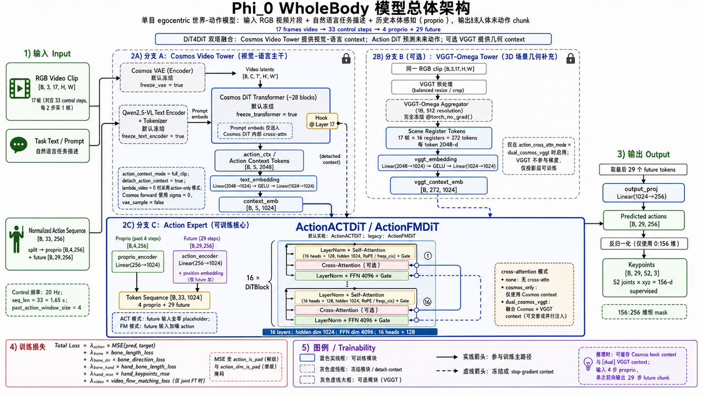

# Φ-0

单目 egocentric 视频 + 语言 → **未来 action chunk**。视觉-语言侧 **Qwen3-VL-2B**（Psi0 checkpoint，默认冻结）提取 multimodal context；动作侧 Action DiT（**ACT** 直接回归或 **FM** flow matching）。支持 **256-d** keypoints（legacy）与 **512-d unified**（Xperience / pick-tissue / SONIC）。

> 架构已从 Cosmos Video2World hook 迁移至 Qwen3-VL encoder；不再依赖 Cosmos 权重或视频生成路径。

---

## 模型架构

<p align="center">
  
</p>

**双塔 / 三塔结构**：Qwen3-VL 提供视觉-语言 hidden states（2048-d）供 Action DiT cross-attention；可选 VGGT-Omega 塔提供 3D scene registers；Action DiT 预测未来 action chunk（horizon 由配置决定，如 29 步 @ 20 Hz 或 pick-tissue @ 50 Hz）。

| 模块 | 默认 | 说明 |
|------|------|------|
| Qwen3-VL-2B | 冻结 | Psi0 checkpoint，`vlm.model_path`；`extract_action_context()` → 最后一层 hidden |
| Processor | — | `qwen_vl_utils` + chat template；图像 180×320（H×W，Psi0 对齐） |
| VGGT（可选） | `phi0_dual_vggt` | `vggt_omega_1b_512.pt`，aggregator 冻结 |
| Action 头 | `act` | Action DiT；`past_action_window_size` 依任务（legacy 4 / pick-tissue 1） |

Cross-attn 模式（`action_cross_attn_mode`）：

| 模式 | 偶数层 | 奇数层 | 配置 |
|------|--------|--------|------|
| `interleave_vlm`（双塔基线） | cross → Qwen3-VL hidden | 仅 self+FFN | `phi0_full` |
| `dual_vlm_vggt`（三塔） | cross → Qwen3-VL | cross → VGGT registers | `phi0_dual_vggt` |

旧名 `interleave_cosmos` / `dual_cosmos_vggt` 在代码中仍作别名，均映射到上述 VLM 路径。

---

## Eval 效果（legacy 256-d）

历史 baseline `phi0_act_proprio_800step` 在 Xperience demo 上的 skeleton 预测可视化（绿=GT，蓝=Pred）：

<p align="center">
  
</p>

---

## 设计优势

### 性能

- **低显存**：VLM 冻结 + 仅训 action_expert 时，pick-tissue 单卡可训可推。
- **推理**：VLM 单次 forward 抽 context，无 Cosmos 17 帧 latent 管线开销。
- **短期记忆**：proprio 前缀 + 当前帧（及可选 VGGT register）作为 action 条件。

### 训练与算法

- **统一表示**：State-Action 同构；512-d unified 一条 token 编码人体 + 机器人 + SONIC latent。
- **Mask Training**：`action_dim_is_pad` 按数据集语义屏蔽未监督维（如 `g1_sonic` 不监督 root delta）。
- **缺失数据训练**：局部 loss 支持不完整 Mocap、无触觉等。

### 扩展能力

- **模块化**：VLM / VGGT / Action Head 可独立冻结或替换。
- **可扩展输出**：256-d 仅监督 keypoints；512-d 按 schema 分段监督。
- **可插拔 Action Head**：ACT / FM；checkpoint 可只存 action_expert。

### 工程与商业化

- **控制器兼容**：SONIC deploy（ZMQ v4 latent）、Humanoid-GPT tracker、GMT 等。
- **长期记忆解耦**：VLM 当前仅作 encoder，不做自回归语言 Agent（规划层可外挂）。
- **快速场景迁移**：Action Head 权重独立 fine-tune（如 pick-tissue 3k/8k/23k）。

---

## 源码与权重获取

**集群内一键复制（推荐）**：

```text
cluster_0:/mnt/data2/wpy/workspace
```

```bash
rsync -av --progress cluster_0:/mnt/data2/wpy/workspace/ /your/local/workspace/
```

| 路径 | 内容 |
|------|------|
| `Phi_0/` | 本仓库源码 |
| `Phi_0/checkpoints/psi0/` | **Qwen3-VL**（Psi0 pretrain，含在 checkpoint 目录内） |
| `Phi_0/experiments/` | 实验 checkpoint（gitignore，本地/rsync 获取） |
| `vggt-omega/checkpoints/` | VGGT-Omega（三塔可选） |
| `Isaac-GR00T/data/` | pick-tissue 等 LeRobot 数据集 |

GitHub 仓库仅含**源码**；权重与实验输出不入库。

---

## 快速开始

### 环境

```bash
conda create -n Phi-0-wpy python=3.10 -y && conda activate Phi-0-wpy
pip install -e /path/to/FastWAM
pip install -e /path/to/Phi_0[train,viz]
pip install qwen-vl-utils   # Qwen3-VL 预处理
pip install -e /path/to/vggt-omega   # 三塔 dual 模式（可选）
```

Smoke：

```bash
PYTHONPATH=src:/path/to/FastWAM/src python scripts/smoke_test.py
```

### VLM 权重

Qwen3-VL 路径在 `configs/model/phi0_full.yaml` → `vlm.model_path`（默认 Psi0 bundle）：

```yaml
vlm:
  model_path: ./checkpoints/psi0/pre.fast.1by1.2601091803.ckpt.ego200k.he30k/...
  freeze: true
```

从集群拷贝 `checkpoints/psi0/` 即可；**无需** Cosmos-Predict2.5 权重。  
`scripts/download_cosmos_weights.sh` 为历史遗留，当前主路径不再使用。

### 训练

```bash
# Legacy 256-d ACT + proprio
PYTHONPATH=src python scripts/train.py --config-name train_act_proprio_800 device=cuda mixed_precision=bf16

# Pick-tissue 512-d unified（推荐 wrapper）
bash scripts/run_train_pick_tissue_xperience_unified_ddp4_3k.sh

# Xperience 512-d unified
bash scripts/run_train_xperience_unified_ddp4.sh
```

Checkpoint：`experiments/<name>/<name>_latest.pt`（可 `save_action_expert_only`）。

### Eval / 可视化

```bash
python scripts/eval_action.py --checkpoint ... --config-name train_xperience_unified
bash scripts/run_eval_visualize_xperience_unified.sh
bash scripts/run_pick_tissue_sonic_latent_eval.sh   # SONIC deploy + mp4
```

### Deploy

Legacy 256-d JSONL deploy 仍可用；pick-tissue 走 SONIC / HGPT ZMQ，见下文与 [`docs/unified_action_design.md`](docs/unified_action_design.md)。

---

## 技术细节

### 数据流（VLM → Action）

```
RGB frame(s) + task instruction
  → Qwen3-VL processor (chat template, add_generation_prompt)
  → VLM forward (frozen, output_hidden_states=True)
  → hidden_states[-1]  [B, S, 2048]  → Action DiT cross-attn context

[可选] RGB clip ──► VGGT-Omega aggregator (frozen) ──► scene registers
                      └── 奇数层 cross-attn (dual_vlm_vggt)

Proprio 前缀 + future horizon ──► ActionACTDiT / ActionFMDiT ──► action chunk
```

VLM **不做** `.generate()` 文本解码；语言指令仅作 multimodal 条件。

### 损失

```text
loss = λ_a · MSE_action (+ bone / hand 辅助项，legacy 256-d)
```

- Unified / pick-tissue：`lambda_video = 0`，无视频生成 loss。
- MSE 受 `action_is_pad`、`action_dim_is_pad` 掩码。

### Clip 时间轴（legacy 20 Hz 示例）

| 参数 | 值 | 含义 |
|------|-----|------|
| `control_fps` | 20 Hz | 统一 action 时间轴 |
| `seq_len` | 33 | control 窗口 |
| `past_action_window_size` | 4（legacy） / 1（pick-tissue） | proprio 前缀 |

Pick-tissue 使用 **50 Hz**，见 unified 文档。

### D_raw（256 维）

| 切片 | 索引 | 维数 | 训练 loss | 说明 |
|------|------|------|-----------|------|
| `keypoints_52` | 0:156 | 156 | ✅ | 52 关节 × (x,y,z) |
| `legacy_buffer_gap` | 156:211 | 55 | ❌ | 保留对齐 legacy buffer |
| `betas_storage` | 211:227 | 16 | ❌ | 元数据存储槽 |
| `tactile_storage` | 227:237 | 10 | ❌ | 触觉预留 |
| `reserved` | 237:256 | 19 | ❌ | padding |

### Pick-tissue unified（512 维，50 Hz）

完整 action 布局、dim mask、deploy 路径见 **[`docs/unified_action_design.md`](docs/unified_action_design.md)**。

概要：一条 `unified_action[512]` 同时编码 SMPL 人体、Dex3 夹爪、G1 body qpos、SONIC motion_token。

| 切片 | 内容 | pick-tissue loss（`g1_sonic`） |
|------|------|-------------------------------|
| `0:3` | root trans delta | ❌ |
| `3:346` | SMPL-H body | ✅ |
| `346:360` | Dex3 14 维（WBC 顺序） | ✅ |
| `360:396` | G1 qpos 36 维（采集 WBC，非 GMR） | ✅ |
| `396:460` | SONIC motion_token 64 维 | ✅ |
| `460:512` | reserved | ❌ |

数据目录：`Isaac-GR00T/data/pick_tissue_xperience_unified`（由 `pick_tissue_valid` 转换，`CODE_VERSION=v2.8`）。

---

## Pick-tissue 工作流

### 1. 建数据

```bash
# valid 合并 + 512-d unified 转换（常用）
/mnt/data/miniconda3/envs/Phi-0-wpy/bin/python scripts/data/isaac_groot_to_xperience_unified_lerobot.py \
  --data-root /mnt/data2/wpy/workspace/Isaac-GR00T/data/pick_tissue_valid \
  --out-dir /mnt/data2/wpy/workspace/Isaac-GR00T/data/pick_tissue_xperience_unified \
  --num-workers 8

# 从 raw session 一键 rebuild
bash scripts/run_pick_tissue_from_raw_rebuild_eval.sh

# 训练前 predecode 视频（4 路并行，cv2 backend）
bash scripts/data/run_predecode_pick_tissue_4gpu.sh
```

### 2. 训练（4×GPU DDP，action_expert only）

```bash
bash scripts/run_train_pick_tissue_xperience_unified_ddp4_8k.sh   # 8k steps
bash scripts/run_train_pick_tissue_xperience_unified_ddp4_3k.sh   # 3k 快速实验
bash scripts/run_train_pick_tissue_xperience_unified_ddp4_23k.sh  # 续训 23k
```

Checkpoint 示例：`experiments/pick_tissue_xperience_unified_3k_ddp4_fast/pick_tissue_xperience_unified_act_latest.pt`

### 3. SONIC 开环 eval + 录 mp4（**推荐**，含三指夹爪）

两阶段：离线 precompute（VLM 推理 → npz）→ sim + TensorRT deploy + ZMQ v4 流式回放。

```bash
# 模型 eval，ep447，top panel 无 marker，全 episode
CHECKPOINT=/mnt/data2/wpy/workspace/Phi_0/experiments/pick_tissue_xperience_unified_3k_ddp4_fast/pick_tissue_xperience_unified_act_latest.pt \
CONFIG_NAME=train_pick_tissue_xperience_unified_ddp4_3k \
UNIFIED_EP=447 \
GT_PANEL_LAYOUT=top \
ENABLE_G1_DEBUG_OVERLAY=0 \
MOTION_SECONDS=20 \
CUDA_VISIBLE_DEVICES=4 \
bash scripts/run_pick_tissue_sonic_latent_eval.sh

# GT 对照（不设 CHECKPOINT）
GT_PANEL_LAYOUT=top ENABLE_G1_DEBUG_OVERLAY=0 UNIFIED_EP=447 MOTION_SECONDS=20 \
bash scripts/run_pick_tissue_sonic_latent_eval.sh
```

**仅离线 precompute（不启 sim/deploy）：**

```bash
python scripts/phi0_sonic_latent_zmq_publisher.py \
  --checkpoint /path/to.ckpt \
  --config-name train_pick_tissue_xperience_unified_ddp4_3k \
  --episode-idx 447 \
  --motion-seconds 20 \
  --precompute-out logs/ep447_precompute.npz \
  --device cuda
```

输出默认：`logs/pick_tissue_finetune/sonic_latent_model_<ts>/pick_tissue_ep447_sonic_latent_model.mp4`

| 可视化 | 环境变量 |
|--------|----------|
| top panel + 无 marker（推荐） | `GT_PANEL_LAYOUT=top ENABLE_G1_DEBUG_OVERLAY=0` |
| inset + debug marker | 脚本默认 |
| 复用已有 precompute | 把 npz 放到 `$WORK_DIR/sonic_latent_precompute.npz` 或 `SKIP_PRECOMPUTE=1` |

### 4. Humanoid-GPT ZMQ eval（tracker sim，**无** Dex3 手模）

见 [`experiments/phi0_hgpt_zmq/README.md`](experiments/phi0_hgpt_zmq/README.md)。

```bash
CHECKPOINT=/path/to.ckpt EPISODE_IDX=447 USE_GT=0 DEPLOY_MODE=smpl \
CUDA_VISIBLE_DEVICES=4 bash scripts/run_pick_tissue_hgpt_zmq_eval.sh
```

---

## 脚本速查

| 脚本 | 用途 |
|------|------|
| `scripts/data/isaac_groot_to_xperience_unified_lerobot.py` | GR00T valid → 512-d LeRobot |
| `scripts/data/run_predecode_pick_tissue_4gpu.sh` | 并行 predecode 训练视频 |
| `scripts/run_pick_tissue_from_raw_rebuild_eval.sh` | raw → valid → unified → smoke eval |
| `scripts/rebuild_pick_tissue_finetune_data.sh` | valid → **sonic 43s/100a** 格式（Pi0.5 线） |
| `scripts/run_train_pick_tissue_xperience_unified_ddp4_*.sh` | pick-tissue DDP 训练 |
| `scripts/run_pick_tissue_sonic_latent_eval.sh` | SONIC deploy 开环 eval + mp4 |
| `scripts/phi0_sonic_latent_zmq_publisher.py` | 推理 / `--precompute-out` / `--precompute-in` / ZMQ |
| `scripts/run_pick_tissue_hgpt_zmq_eval.sh` | HGPT tracker 开环 eval |
| `scripts/eval_action.py` | FM chunk MSE（legacy / xperience 配置） |
| `scripts/eval_visualize_xperience_unified.py` | Xperience unified FK 骨骼 GIF |
| `scripts/run_eval_visualize_xperience_unified.sh` | 上者 wrapper |
| `scripts/run_train_xperience_unified_ddp4.sh` | Xperience 512-d 训练 |

**Deploy 核心模块**（`src/phi0/deploy/`）：`gt_io.py`（Lazy GT LUT）、`sonic_zmq_io.py`、`dex3_gripper.py`、`ref_traj_builder.py`、`sonic_latent_gt_replay.py`。

**单元测试：**

```bash
PYTHONPATH=src pytest tests/unit/test_pick_tissue_sonic_latent_pipeline.py -q
```

---

## 配置

| 配置 | 用途 |
|------|------|
| `configs/model/phi0_full.yaml` | Qwen3-VL + ACT（`interleave_vlm`） |
| `configs/model/phi0_dual_vggt.yaml` | + VGGT（`dual_vlm_vggt`） |
| `configs/train_pick_tissue_xperience_unified_ddp4_*.yaml` | pick-tissue 512-d DDP |
| `configs/train_xperience_unified.yaml` | Xperience 512-d |

---

## 目录

```
Phi_0/
├── assets/
├── configs/
├── docs/unified_action_design.md
├── scripts/                          # train, eval, deploy, data
├── src/phi0/
│   ├── models/                       # phi0, action_dit, vlm, vggt
│   ├── data/
│   ├── inference/
│   ├── deploy/                       # SONIC / HGPT / gripper / GT IO
│   └── schema/
├── checkpoints/                      # gitignore（Psi0 Qwen3-VL 等）
└── experiments/                      # gitignore
```

---

## 状态

| 项 | 状态 |
|----|------|
| Qwen3-VL observation tower + ACT/FM action 头 | ✅ |
| Keypoints D_raw 256 + dim mask | ✅ |
| Unified 512-d（Xperience / `g1_sonic`） | ✅ |
| Pick-tissue + SONIC latent deploy eval | ✅ |
| Phi-0 → HGPT ZMQ eval | ✅ |
| Lazy GT proprio LUT | ✅ |
| VGGT dual cross-attn（三塔） | ✅ |
| VLM 自回归语言 Agent | ❌（仅 encoder；规划可外挂） |
| RL / MoE Action Head | 🔜 预留 |
