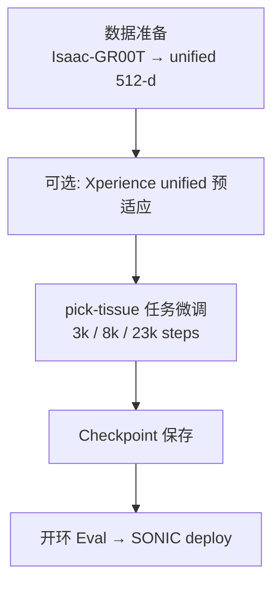

# Action 头后训练

## 1. 概述

Phi0 的 **核心训练阶段**：冻结 VLM，仅训练 Action DiT（`action_expert`）。在任务数据（如 pick-tissue）上微调，产出可部署的 action checkpoint。

## 2. 训练流水线



## 3. 数据格式

### 3.1 数据源

| 路径 | 格式 | 说明 |
|------|------|------|
| `Isaac-GR00T/data/pick_tissue_valid` | GR00T LeRobot | 原始 831 ep |
| `Isaac-GR00T/data/pick_tissue_xperience_unified` | **512-d unified** LeRobot | **Phi0 主训练集** |

### 3.2 Unified 512-d 布局

```
[0:346)   SMPL-H 语义
[346:360) G1 Dex3 夹爪 14 维
[360:396) G1 body qpos 36 维
[396:460) SONIC motion_token 64 维
[460:512) reserved（不参与 loss）
```

详见 `docs/unified_action_design.md`。

### 3.3 观测输入

| 参数 | 值 |
|------|-----|
| 视角 | ego + left_wrist 双视角 |
| 图像尺寸 | 180×320（H×W） |
| 序列长度 | `seq_len=33`（1 步 proprio + 32 步未来 @ 50 Hz） |
| 语言 | `pick tissue` |

### 3.4 数据准备命令

```bash
# 全链路重建
bash Isaac-GR00T/scripts/rebuild_g1_manip_training_data.sh

# 仅 pick-tissue unified 转换
python scripts/data/isaac_groot_to_xperience_unified_lerobot.py \
  --data-root Isaac-GR00T/data/pick_tissue_valid \
  --out-dir Isaac-GR00T/data/pick_tissue_xperience_unified

# predecode 训练视频（4 GPU 并行）
bash scripts/data/run_predecode_pick_tissue_4gpu.sh
```

## 4. 损失函数

### 4.1 ACT 模式（pick-tissue 默认）

```
loss = λ_action · MSE(pred, target)
```

- 带 `action_is_pad` / `action_dim_is_pad` 掩码
- pick-tissue：`λ_video=0`，`λ_bone=0`（无骨骼辅助项）
- 监督维度：SMPL `[3:346]`、夹爪 `[346:360]`、qpos `[360:396]`、SONIC `[396:460]`
- 不监督：root delta `[0:3]`、reserved `[460:512]`

### 4.2 FM 模式（Flow Matching）

- 对 future action 加噪，预测 velocity
- MSE on masked dimensions
- 配置项：`action_fm`（beta 噪声调度、1000 buckets、10 步推理）

### 4.3 VLM 前向

```python
torch.inference_mode()  # VLM 无梯度
hidden = vlm.extract_action_context()  # [B, S, 2048]
# → Action DiT cross-attention
```

## 5. 超参数

### 5.1 pick-tissue 主实验

| 参数 | 3k fast | 8k | 23k 续训 |
|------|---------|-----|----------|
| 配置 | `train_pick_tissue_xperience_unified_ddp4_3k` | `..._ddp4_8k` | `..._ddp4_23k` |
| GPU | 4× DDP（4,5,6,7） | 同左 | 同左 |
| per-GPU batch | 16 | 8/16 | 16 |
| max_steps | 3000 | 8000 | 23000 |
| save_every | 3000 | 4000 | 4000 |
| lr_action | 1e-4 | 1e-4 | 1e-4 |
| lr_vlm | 0 | 0 | 0 |
| warmup | 500 | 500 | 0（续训） |
| scheduler | cosine | cosine | cosine |
| weight_decay | 1e-6 | 1e-6 | 1e-6 |
| mixed_precision | bf16 | bf16 | bf16 |

### 5.2 模型配置

```yaml
# configs/model/phi0_xperience_unified.yaml
action_expert:
  mode: act
  hidden_dim: 1024
  num_layers: 4
  num_heads: 4
  raw_action_dim: 512
  past_action_window_size: 1
  action_cross_attn_mode: interleave_vlm
```

## 6. 运行命令

### 6.1 Xperience unified 预适应（可选）

```bash
bash scripts/run_train_xperience_unified_ddp4.sh
```

### 6.2 pick-tissue 微调

```bash
# 3k 快速验证
bash scripts/run_train_pick_tissue_xperience_unified_ddp4_3k.sh

# 8k
bash scripts/run_train_pick_tissue_xperience_unified_ddp4_8k.sh

# 续训至 23k
bash scripts/run_train_pick_tissue_xperience_unified_ddp4_23k.sh
```

### 6.3 Hydra 直调

```bash
python -m torch.distributed.run --nproc_per_node=4 scripts/train.py \
  --config-name train_pick_tissue_xperience_unified_ddp4_3k distributed=true
```

### 6.4 Legacy 256-d

```bash
PYTHONPATH=src python scripts/train.py \
  --config-name train_act_proprio_800 device=cuda mixed_precision=bf16
```

## 7. Checkpoint 策略

```yaml
save_action_expert_only: true  # 仅存 action_expert 权重
```

产出示例：

```
experiments/pick_tissue_xperience_unified_3k_ddp4_fast/
  pick_tissue_xperience_unified_act_latest.pt
  loss_curve.csv
```

VLM 权重从 `vlm.model_path` 单独加载，不写入 action checkpoint。

## 8. 实验结果

### 8.1 pick-tissue 3k→23k loss 曲线

| 里程碑 | step | loss_action |
|--------|------|-------------|
| 训练起点 | 0 | ~0.347 |
| 1k | 1000 | ~0.056 |
| 3k 结束 | 2999 | ~0.048 |
| 续训起点 | 3000 | ~0.030 |
| 8k | 7999 | ~0.034 |
| 23k 结束 | 22999 | ~0.024 |

- 每步约 35–60 ms（4×GPU DDP）
- 日志：`logs/pick_tissue_finetune/train_3k_fast.log`、`train_23k_continue.log`

### 8.2 Eval 验证

```bash
CHECKPOINT=experiments/pick_tissue_xperience_unified_3k_ddp4_fast/..._latest.pt \
UNIFIED_EP=447 bash scripts/run_pick_tissue_sonic_latent_eval.sh
```

- 开环 SONIC sim 录屏可用
- 演示 GIF：`assets/pick_tissue_ep447_sonic_latent_eval.gif`

### 8.3 Agent 全链路

- `logs/agent_sonic_sim_demo/agent_result.json`：Agent 正确选中 `pick_tissues`，Phi0 predict `(8, 512)`

## 9. 并行 baseline 线

工作区同时维护多条 pick-tissue 微调线（独立训练，共享数据源）：

| 线 | 脚本 | 状态 |
|----|------|------|
| **Phi0 unified 512-d** | `run_train_pick_tissue_xperience_unified_ddp4_*.sh` | ✅ 最完整 |
| GR00T N1.7 | `Isaac-GR00T/scripts/run_finetune_pick_tissue.sh` | NCCL timeout |
| Pi0.5 | `src/openpi/train_pytorch.py` | step 90 崩溃 |
| Psi0 | `Psi0-main/scripts/train.py` | 并行实验中 |

一键启动全部：

```bash
bash scripts/launch_pick_tissue_all_finetune.sh
```

## 10. 关键文件

| 类别 | 路径 |
|------|------|
| 训练入口 | `scripts/train.py` |
| 训练循环 | `src/phi0/runtime.py` |
| 损失实现 | `src/phi0/models/phi0.py` |
| pick-tissue 配置 | `configs/train_pick_tissue_xperience_unified_ddp4_*.yaml` |
| 数据配置 | `configs/data/pick_tissue_xperience_unified.yaml` |
| 模型配置 | `configs/model/phi0_xperience_unified.yaml` |
| Unified action 设计 | `docs/unified_action_design.md` |
