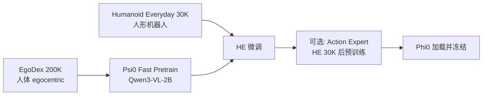

# 预训练

## 1. 概述

在 Phi0 训练体系中，「预训练」指 **Psi0 Qwen3-VL 预训练**（外部项目完成），而非 Phi0 仓库内的训练阶段。

Phi0 **直接加载并冻结** Psi0 权重，不重复此阶段。

## 2. Psi0 预训练流水线



### 2.1 阶段 1：EgoDex 预训练

| 参数 | 值 |
|------|-----|
| 数据集 | EgoDex 200K |
| 模型 | Qwen3-VL-2B |
| 脚本 | `Psi0-main/scripts/train/psi0/pretrain-egodex-psi0-fast.sh` |
| 产出 | `pre.fast.1by1.2601091803.ckpt.ego200k` |

### 2.2 阶段 2：Humanoid Everyday 微调

| 参数 | 值 |
|------|-----|
| 数据集 | Humanoid Everyday 30K |
| 基础 | EgoDex 预训练权重 |
| 脚本 | `Psi0-main/scripts/train/psi0/pretrain-he-psi0-fast.sh` |
| 产出 | `pre.fast.1by1.2601091803.ckpt.ego200k.he30k` |

### 2.3 阶段 3（可选）：Action Expert 后预训练

| 参数 | 值 |
|------|-----|
| 数据集 | HE 30K |
| 脚本 | `Psi0-main/scripts/train/psi0/posttrain-he-psi0.sh` |
| 产出 | `postpre.1by1.pad36.2601131206.ckpt.he30k` |

Phi0 默认使用 **阶段 2 产出**（VLM backbone），Action Expert 在 Phi0 内独立训练。

## 3. Phi0 中的使用方式

### 3.1 权重加载

```yaml
# configs/model/phi0_full.yaml
vlm:
  enabled: true
  model_path: checkpoints/psi0/pre.fast.1by1.2601091803.ckpt.ego200k.he30k
  freeze: true
```

本地路径：`Phi_0/checkpoints/psi0/pre.fast.1by1.2601091803.ckpt.ego200k.he30k/`

### 3.2 冻结策略

| 组件 | 训练时 | 说明 |
|------|--------|------|
| Qwen3-VL backbone | `freeze=true` | `torch.inference_mode()` 抽 context |
| Action DiT | 可训练 | Phi0 核心训练对象 |

学习率配置：

```yaml
lr_vlm: 0          # VLM 不更新
lr_action: 1e-4    # Action Head 学习率
```

## 4. 预训练数据

### 4.1 EgoDex 200K

- 人体 egocentric 操作视频
- 用于学习通用视觉-语言-动作表征
- 图像规格：180×320（H×W），与 Phi0 对齐

### 4.2 Humanoid Everyday 30K

- 人形机器人日常操作
- 桥接人体动捕与人形机器人域
- 使 VLM 具备机器人场景理解能力

## 5. 与 Phi0 训练的关系

```
[外部] Psi0 VLM 预训练
    ↓ 加载并冻结
[Phi0] 可选: Xperience unified 预适应 (train_xperience_unified)
    ↓
[Phi0] 任务微调: pick-tissue (train_pick_tissue_xperience_unified_ddp4_*)
    ↓
[Phi0] Eval / Deploy
```

Phi0 不重复 Psi0 预训练；若需更新 VLM，应在 Psi0 项目中完成后再更新 `vlm.model_path`。

## 6. Agent 语言塔（独立）

LangChain Agent 使用 **官方** `Qwen/Qwen3-VL-2B-Instruct` 权重，与 Psi0 VLM **完全分离**：

| 用途 | 权重 | 项目 |
|------|------|------|
| Action encoder | Psi0 HE 微调 | Phi0 |
| 语言对话 | 官方 Instruct | Agent |

Psi0 内嵌 VLM **无对话能力**；Agent 必须用官方 Instruct 权重。

## 7. 运行 Psi0 预训练（外部）

```bash
# 在 Psi0-main 项目中
bash Psi0-main/scripts/train/psi0/pretrain-egodex-psi0-fast.sh
bash Psi0-main/scripts/train/psi0/pretrain-he-psi0-fast.sh
bash Psi0-main/scripts/train/psi0/posttrain-he-psi0.sh
```

Phi0 只需拷贝权重到 `checkpoints/psi0/`。

## 8. 关键文件

| 类别 | 路径 |
|------|------|
| VLM 塔实现 | `src/phi0/models/vlm/tower.py` |
| VLM 配置 | `configs/model/phi0_full.yaml` |
| 运行时加载 | `src/phi0/runtime.py` → `create_phi0()` |
| Psi0 预训练脚本 | `Psi0-main/scripts/train/psi0/` |
